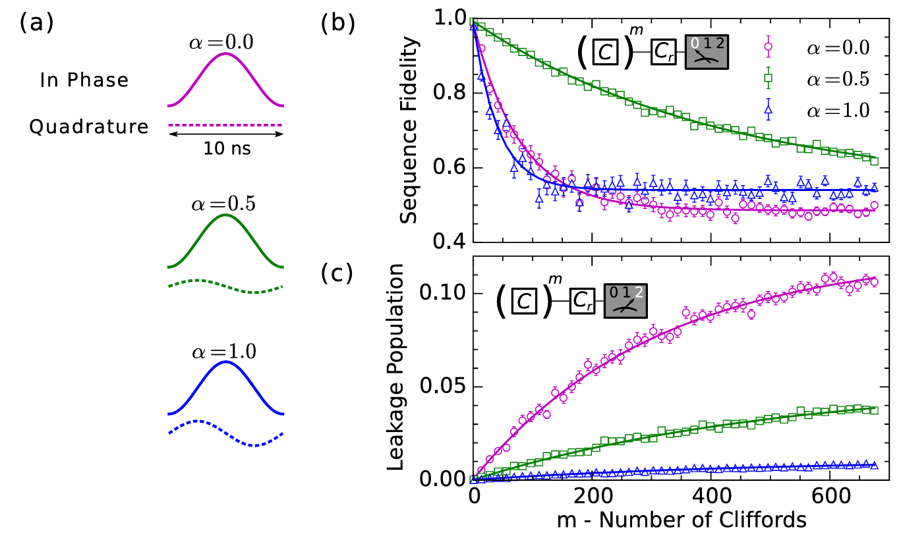

# Calibration Notes

- [1. Higher states error](#1-higher-states-error)
  - [1.1. Characterize](#11-characterize)
  - [1.2. Correction](#12-correction)

## 1. Higher states error

### 1.1. Characterize

  Fig. 7.2</img>

For total error, fit equations:
$$F(m)=Ap^m+B$$

Average error per Clifford:
$$r_{\mathrm{Clifford}}=(1-p)(1-1/d)$$

For leakage error, fit equations:
$$\begin{aligned}p_{|2\rangle}(m)&=p_\infty\left(1-e^{-\Gamma m}\right)+p_0e^{-\Gamma m}\\\Gamma&=\gamma_\uparrow+\gamma_\downarrow\quad p_\infty=\gamma_\uparrow/\Gamma\end{aligned}$$

### 1.2. Correction

How to correct phase error:
$$\Omega^{\prime\prime}(t)=\Omega^{\prime}(t)e^{2\pi i\delta ft}$$

> Note:  
> DRAG weight | optimal detuning are negatively related.  
> Longer pulse $\to$ smaller slope

Prescription:

1. Optimize detuning for each $\alpha$ to get best RB fidelity
1. Now that fidelity is independent from $\alpha$, optimize $\alpha$ for leakage