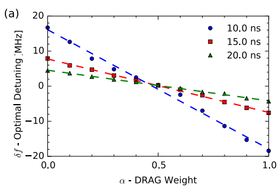
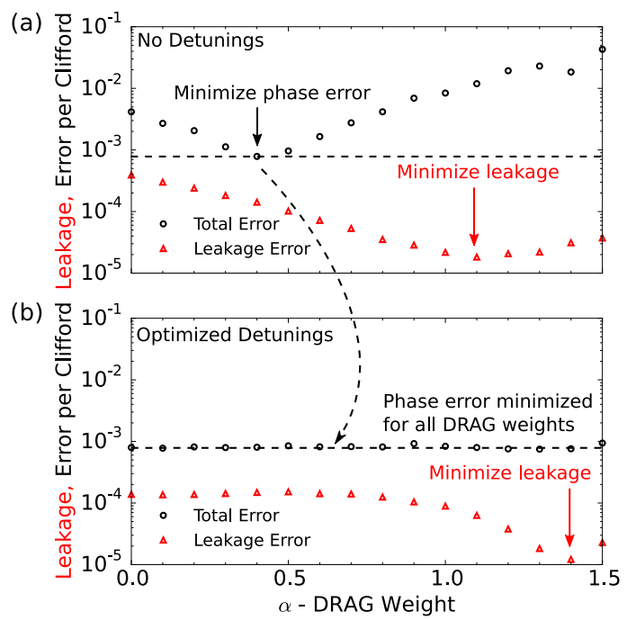
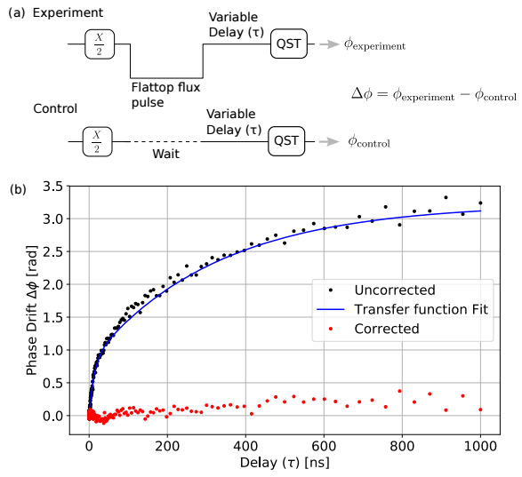
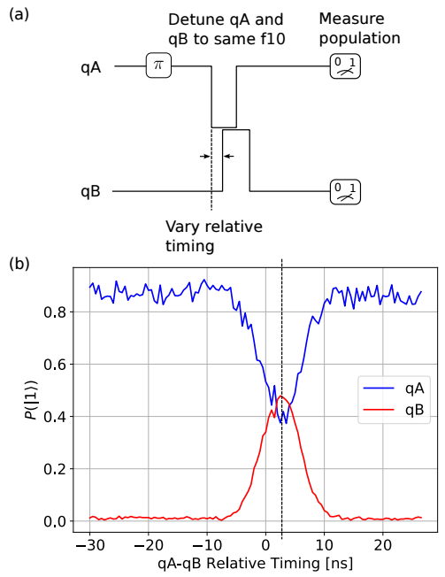
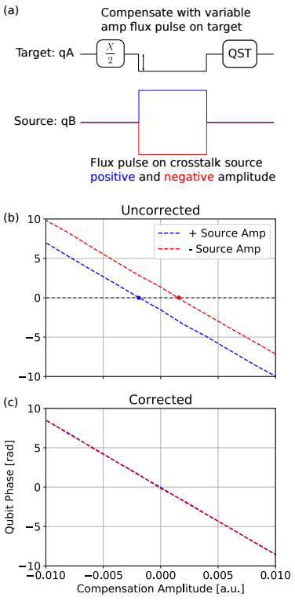

# Calibration Notes

- [1. Higher states error](#1-higher-states-error)
  - [1.1. Characterize](#11-characterize)
  - [1.2. Correction](#12-correction)
    - [1.2.1. Drive](#121-drive)
    - [1.2.2. Correction procedure](#122-correction-procedure)
    - [1.2.3. Leakage source](#123-leakage-source)
- [2. Two-qubit calibration](#2-two-qubit-calibration)
  - [2.1. Pre-distortion](#21-pre-distortion)
  - [2.2. Multi-qubit timing](#22-multi-qubit-timing)
  - [2.3. Flux crosstalk](#23-flux-crosstalk)

## 1. Higher states error

### 1.1. Characterize

  Fig. 7.2</img>

For total error, fit equations:
$$F(m)=Ap^m+B$$

Average error per Clifford:
$$r_{\mathrm{Clifford}}=(1-p)(1-1/d)$$

For leakage error, fit equations:
$$\begin{aligned}p_{|2\rangle}(m)&=p_\infty\left(1-e^{-\Gamma m}\right)+p_0e^{-\Gamma m}\\\Gamma&=\gamma_\uparrow+\gamma_\downarrow\quad p_\infty=\gamma_\uparrow/\Gamma\end{aligned}$$

### 1.2. Correction

#### 1.2.1. Drive

How to correct phase error:
$$\Omega^{\prime\prime}(t)=\Omega^{\prime}(t)e^{2\pi i\delta ft}$$

> Note:  
>   Fig. 7.4</img>  
> DRAG weight | optimal detuning are negatively related.  
> Longer pulse $\to$ smaller slope

#### 1.2.2. Correction procedure

  Fig. 7.5</img>

1. For each $\alpha$, optimize detuning to get best RB fidelity
1. Now that fidelity is independent from $\alpha$, optimize $\alpha$ for leakage

#### 1.2.3. Leakage source

- Leakage is due to heat or noise.
- $|2\rangle$ state peak is around $20 \mathrm{ns}$
- DRAG after $20 \mathrm{ns}$ is meaningless
- There is a minimal leakage rate, see [O’Malley, 2015](https://journals.aps.org/prapplied/abstract/10.1103/PhysRevApplied.3.044009)

## 2. Two-qubit calibration

### 2.1. Pre-distortion

</img>

Distortion model:
$$\tilde{X}_{\mathrm{qubit}}(\omega)=H(\omega)\tilde{X}_{\mathrm{in}}(\omega)$$
- $\tilde{X}_{\mathrm{in}}$ is the Fourier transform of our intended signal
- $\tilde{X}_{\mathrm{qubit}}$ is the signal actually seen by the qubit

Transfer function:
$$H(\omega)=1+\sum_{i=1}^k\frac{i\alpha_i\omega}{i\omega+\tau_i}$$
- $\alpha_i > 0$ : overshoots
- $\alpha_i < 0$ : undershoots

> Transfer function calibration procedure:
> 1. Parameterize $H$
> 2. Simulate input signal ${X}_{\mathrm{in}}$, calculate $H(\omega)\tilde{X}_{\mathrm{in}}(\omega)$
> 3. $\tilde{X}_{\mathrm{qubit}}(\omega) \to \omega_q(t)$
> 4. Integrate $\omega_q(t) - \omega_{q, \text{static}}$ to get phase $\phi_z$
> 5. Calculate cost function $\mathrm{MSE}(\phi_z, \hat{\phi}_z)$
> 6. Minimize cost

### 2.2. Multi-qubit timing

</img>

### 2.3. Flux crosstalk

  Fig. 8.4</img>

$$
\begin{align*}
  \Phi & =MV\\\begin{pmatrix}\phi_1
  \\
  \phi_2\end{pmatrix} & =\begin{pmatrix}M_1&m_{12}\\\\m_{21}&M_2\end{pmatrix}\begin{pmatrix}V_1\\\\V_2\end{pmatrix}
\end{align*}
$$
where $V$ is voltage output of our DAC, and $\Phi$ is flux biases at the qubit SQUIDs.
